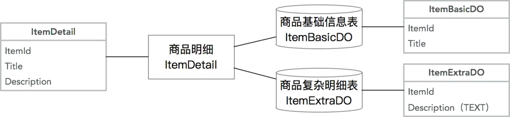
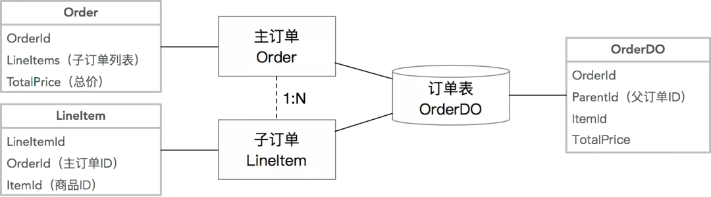
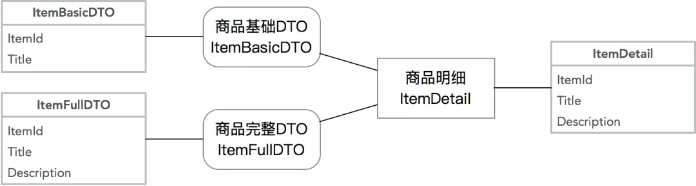
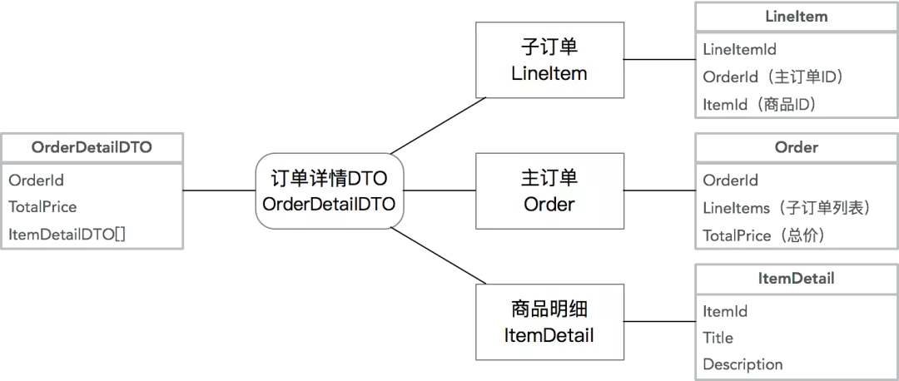
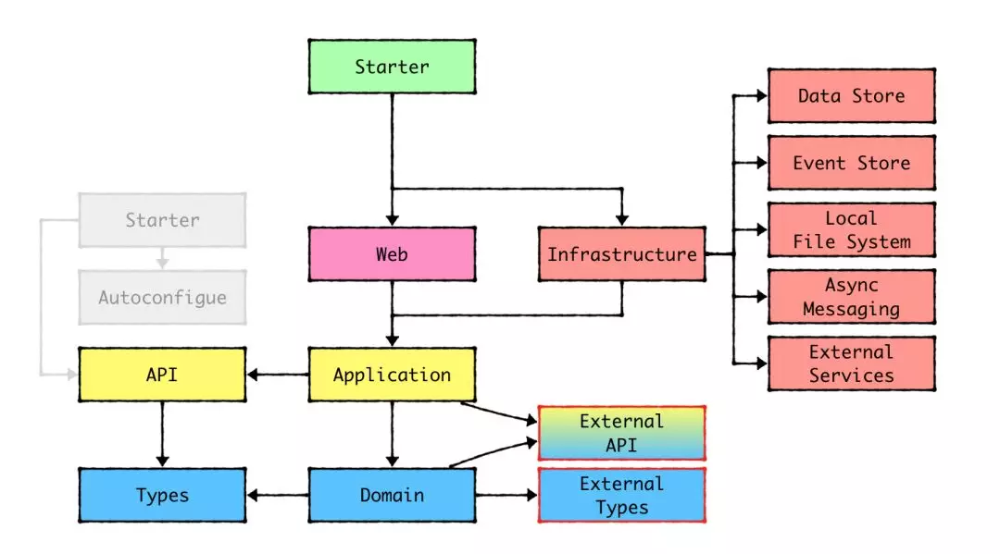
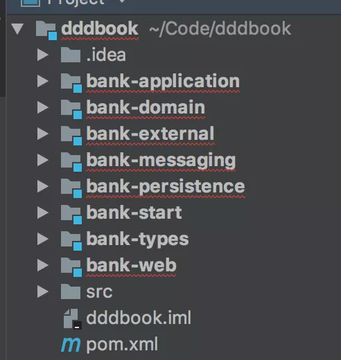
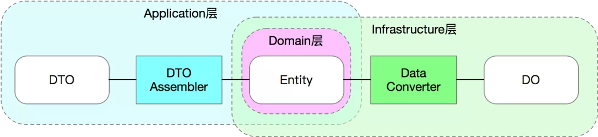

### 模型对象代码规范

#### 对象类型

> 3 种模型的区别，Entity、Data Object (DO) 和 Data Transfer Object (DTO)：

* Data Object （DO、数据对象）：实际上是我们在日常工作中最常见的数据模型。但是在 DDD 的规范里，DO 应该仅仅作为`数据库物理表格的映射`，不能参与到业务逻辑中。为了简单明了，**DO 的字段类型和名称应该和数据库物理表格的字段类型和名称一一对应**，这样我们不需要去跑到数据库上去查一个字段的类型和名称。（当然，实际上也没必要一摸一样，只要你在 Mapper 那一层做到字段映射）

* Entity（实体对象）：实体对象是我们正常业务应该用的`业务模型`，它的字段和方法应该和业务语言保持一致，和持久化方式无关。也就是说，Entity 和 DO 很可能有着完全不一样的字段命名和字段类型，甚至嵌套关系。`Entity 的生命周期应该仅存在于内存中，不需要可序列化和可持久化`。

* DTO（传输对象）：主要作为 Application 层的入参和出参，比如 CQRS 里的 Command、Query、Event，以及 Request、Response 等都属于 DTO 的范畴。`DTO 的价值在于适配不同的业务场景的入参和出参，避免让业务对象变成一个万能大对象`。

> 模型对象之间的关系

在实际开发中 DO、Entity 和 DTO 不一定是 1:1:1 的关系。

一些常见的非 1:1 关系如下： 

##### Entity 与数据表

复杂的 Entity 拆分多张数据库表：常见的原因在于字段过多，导致查询性能降低，需要将非检索、大字段等单独存为一张表，提升基础信息表的检索效率。

常见的案例如商品模型，将商品详细描述等大字段单独保存，提升查询性能：

多个关联的 Entity 合并一张数据库表：这种情况通常出现在拥有复杂的 Aggregate Root - Entity 关系的情况下，且需要分库分表，为了避免多次查询和分库分表带来的不一致性，牺牲了单表的简洁性，提升查询和插入性能。

常见的案例如主子订单模型：

##### Entity 与 DTO

从复杂 Entity 里抽取部分信息形成多个 DTO：这种情况通常在 Entity 复杂，但是调用方只需要部分核心信息的情况下，通过一个小的 DTO 降低信息传输成本。

同样拿商品模型举例，基础 DTO 可能出现在商品列表里，这个时候不需要复杂详情：

合并多个 Entity 为一个 DTO：这种情况通常为了降低网络传输成本，降低服务端请求次数，将多个 Entity、DP 等对象合并序列化，并且让 DTO 可以嵌套其他 DTO。

同样常见的案例是在订单详情里需要展示商品信息：

### 代码组织结构

### 模型所在模块和转化器

#### 模型规范总结

|         | DO             | Entity                           | DTO                                    |
|---------|----------------|----------------------------------|----------------------------------------|
| 目的      | 数据库表映射         | 业务逻辑                             | 适配业务场景                                 |
| 代码层级    | Infrastructure | Domain                           | Application                            |
| 命名规范    | XxxDO          | Xxx                              | XxxDTO XxxCommand XxxRequest 等 |
| 字段名称标准  | 数据库表字段名        | 业务语言                             | 和调用方商定                                 |
| 字段数据类型  | 数据库字段类型        | 尽量是有业务含义的类型，比如 DP                | 和调用方商定                                 |
| 是否需要序列化 | 不需要            | 不需要                              | 需要                                     |
| 转换器     | Data Converter | Data Converter DTO Assembler | DTO Assembler                          |

