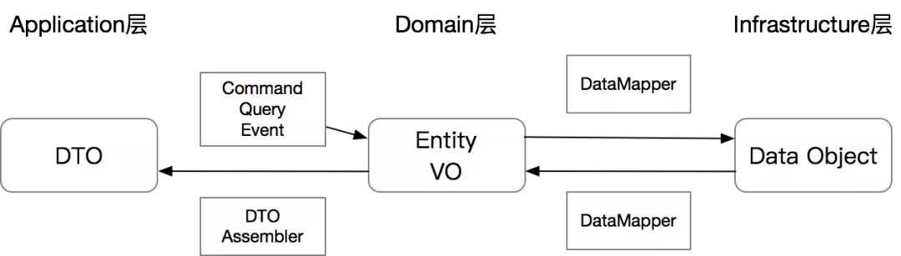
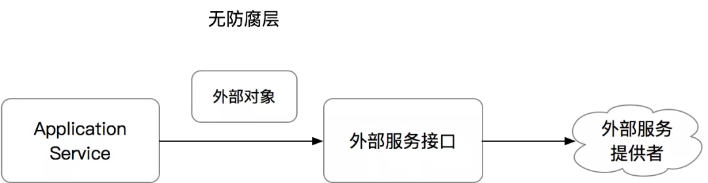
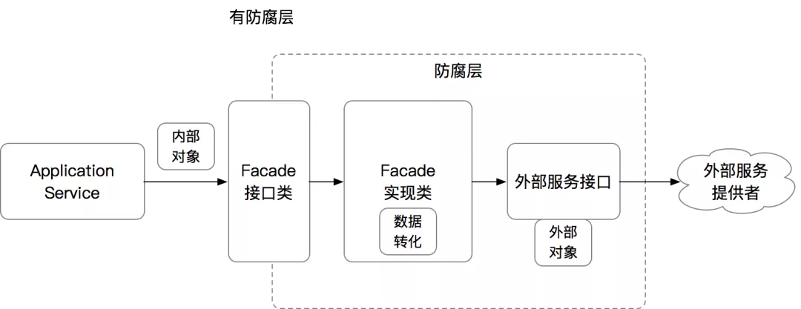

### Application 层规范

> Application 层的几个核心类：
> 
* ApplicationService 应用服务
  * 最核心的类，负责业务流程的编排，但本身不负责任何业务逻辑
* DTO Assembler
  * 负责将内部领域模型转化为可对外的 DTO
* Command、Query、Event 对象
  * 作为 ApplicationService 的入参
* 返回的 DTO
  * 作为 ApplicationService 的出参

#### Command、Query、Event 对象

Command指令
* 指调用方明确想让系统操作的指令，其预期是对一个系统有影响，也就是写操作
* 通常来讲指令需要有一个明确的返回值（如同步的操作结果，或异步的指令已经被接受）。

Query查询
* 指调用方明确想查询的东西，包括查询参数、过滤、分页等条件，其预期是对一个系统的数据完全不影响的，也就是只读操作。

Event事件
* 指一件已经发生过的既有事实，需要系统根据这个事实作出改变或者响应的，通常事件处理都会有一定的写操作
* 事件处理器不会有返回值
* 这里需要注意一下的是，Application 层的 Event 概念和 Domain 层的 DomainEvent 是类似的概念，但不一定是同一回事，这里的 Event 更多是外部一种通知机制而已

##### 为什么要用 CQE 对象？
* 传统类型的参数罗列，本身没有任何业务上的”语意“，只是一堆参数而已，无法明确的表达出来意图
* 难以扩展：每新增一个参数都有可能需要调用方升级
* 难以测试：接口一多，职责随之变得繁杂，业务场景各异，测试用例难以维护

##### CQE 的规范
* 规范：ApplicationService 的接口入参只能是一个 Command、Query 或 Event 对象，CQE 对象需要能代表当前方法的语意
* 唯一可以的例外是根据单一 ID 查询的情况，可以省略掉一个 Query 对象的创建

##### CQE vs DTO
* CQE：CQE 对象是 ApplicationService 的输入，是有明确的 ”意图“ 的，所以这个对象必须保证其 ”正确性“
* DTO：DTO 对象只是数据容器，只是为了和外部交互，所以本身不包含任何逻辑，只是贫血对象

最重要的一点：因为 CQE 是 ”意图“，所以 CQE 对象在理论上可以有”无限“个，每个代表不同的意图；但是 DTO 作为模型数据容器，和模型一一对应，所以是有限的

##### CQE 的校验

* 规范：CQE 对象的校验应该前置，避免在 ApplicationService 里做参数的校验
  * 可以通过 JSR303/380 和 Spring Validation 来实现

这种做法的好处是，让 ApplicationService 更加清爽，同时各种错误信息可以通过 Bean Validation 的 API 做各种`个性化定制`

##### 避免复用 CQE

因为 CQE 是有 “意图” 和 “语意” 的，我们需要尽量避免 CQE 对象的复用，哪怕所有的参数都一样，只要他们的语意不同，尽量还是要用不同的对象

* 规范：针对于不同语意的指令，要避免 CQE 对象的复用

* * *

#### 3 种 ApplicationService 的组织形态

* 一个 ApplicationService 类是一个完整的业务流程，其中每个方法负责处理一个 Use Case
  * 这种的好处是可以完整的收敛整个业务逻辑，从接口类即可对业务逻辑有一定的掌握，适合相对简单的业务流程
  * 坏处就是对于复杂的业务流程会导致一个类的方法过多，有可能代码量过大

* 针对于比较复杂的业务流程，可以通过增加独立的 CommandHandler、EventHandler 来降低一个类中的代码量

* 比较激进一点，通过 CommandBus、EventBus，直接将指令或事件抛给对应的 Handler
  * 接口层通过消息队列收到 MQ 消息后，生成 Event，然后由 EventBus 做路由到对应的 Handler

对于第 3 种方法的说明
```
这种做法可以实现 Interface 层和某个具体的 ApplicationService 或 Handler 的完全静态解藕，在运行时动态 dispatch，做的比较好的框架如 AxonFramework

虽然看起来很便利，但是根据我们自己业务的实践和踩坑发现，当代码中的 CQE 对象越来越多，handler 越来越复杂时，运行时的 dispatch 缺乏了静态代码间的关联关系，导致代码很难读懂

特别是当你需要 trace 一个复杂调用链路时，因为 dispatch 是运行时的，很难摸清楚具体调用到的对象

所以我们虽然曾经有过这种尝试，但现在已经不建议这么做了
```

##### Application Service 是业务流程的封装，不处理业务逻辑 

但如何判断一段代码到底是业务流程还是逻辑呢？

示例：一个重构后的代码

```java
@Service
@Validated
public class CheckoutServiceImpl implements CheckoutService {

    private final OrderDtoAssembler orderDtoAssembler = OrderDtoAssembler.INSTANCE;
    @Resource
    private ItemService itemService;
    @Resource
    private InventoryService inventoryService;
    @Resource
    private OrderRepository orderRepository;

    @Override
    public OrderDTO checkout(@Valid CheckoutCommand cmd) {
        ItemDO item = itemService.getItem(cmd.getItemId());
        if (item == null) {
            throw new IllegalArgumentException("Item not found");
        }

        boolean withholdSuccess = inventoryService.withhold(cmd.getItemId(), cmd.getQuantity());
        if (!withholdSuccess) {
            throw new IllegalArgumentException("Inventory not enough");
        }

        Order order = new Order();
        order.setBuyerId(cmd.getUserId());
        order.setSellerId(item.getSellerId());
        order.setItemId(item.getItemId());
        order.setItemTitle(item.getTitle());
        order.setItemUnitPrice(item.getPriceInCents());
        order.setCount(cmd.getQuantity());

        Order savedOrder = orderRepository.save(order);

        return orderDtoAssembler.orderToDTO(savedOrder);
    }
}
```

* 特征 1：不要有 if/else 分支逻辑：也就是说代码的 Cyclomatic Complexity（循环复杂度）应该尽量等于 1
  * 通常有分支逻辑的，都代表一些业务判断，应该将逻辑封装到 DomainService或者 Entity 里
  * 上面 if (!withholdSuccess) 这种带中断的不算，可以把它看作为 Precondition
* 特征 2：不要有任何计算
  * 例如 getTotalCost() 方法在 Entity 中实现
* 一些数据的转化可以交给其他对象来做
  * 比如 DTO Assembler
  * 注意：DTO Assembler 通常不建议有反操作，也就是不会从 DTO 到 Entity，因为通常一个 DTO 转化为 Entity 时是无法保证 Entity 的准确性的

#### 常用的 ApplicationService “套路”

ApplicationService 的代码通常有类似的结构：
* AppService 通常不做任何决策（Precondition 除外）
* 把所有决策交给 DomainService 或 Entity
* 把跟外部交互的交给 Infrastructure 接口
  * 如 Repository 或防腐层

> 一般的 “套路”

* 准备数据
  * 包括从外部服务或持久化源取出相对应的 Entity、VO 以及外部服务返回的 DTO
* 执行操作
  * 包括新对象的创建、赋值，以及调用领域对象的方法对其进行操作
  * 需要注意的是这个时候通常都是纯内存操作，非持久化
* 持久化
  * 将操作结果持久化，或操作外部系统产生相应的影响，包括发消息等异步操作


如果涉及到对多个外部系统（包括自身的 DB ）都有变更的情况，这个时候通常处在 “分布式事务” 的场景里，无论是用分布式 TX、TCC、还是 Saga 模式，取决于具体场景的设计，在此处暂时略过


结合 Data Mapper，DTO、Entity 和 DataObject 之间的关系如下图



#### Result vs Exception

* Application 层只返回 DTO，可以直接抛异常，不用统一处理
* 所有调用到的服务也都可以直接抛异常，除非需要特殊处理，否则不需要刻意捕捉异常

异常的好处是能明确的知道错误的来源，堆栈等

在 Interface 层统一捕捉异常是为了避免异常堆栈信息泄漏到 API 之外，但是在Application 层，异常机制仍然是信息量最大，代码结构最清晰的方法，避免了Result 的一些常见且繁杂的 Result.isSuccess 判断

> 所以在 Application 层、Domain 层，以及 Infrastructure 层，遇到错误直接抛异常是最合理的方法

#### Anti-Corruption Layer 防腐层

如果任何一个服务的方法变更，或者 ItemDO 字段变更，都会有可能影响到ApplicationService 的代码

也就是说，我们自己的代码会因为强依赖了外部系统的变化而变更，这个在复杂系统中应该是尽量避免的

那么如何做到对外部系统的隔离呢？需要加入 ACL 防腐层

> ACL防腐层的简单原理如下：
* 对于依赖的外部对象，我们抽取出所需要的字段，生成一个内部所需的 VO 或 DTO 类
* 构建一个新的 Facade，在 Facade 中封装调用链路，将外部类转化为内部类
* 针对外部系统调用，同样的用 Facade 方法封装外部调用链路

> 无 ACL


> 有 ACL


Repository 可以认为是一种特殊的 ACL，屏蔽了具体数据操作的细节，即使底层数据库结构变更，数据库类型变更，或者加入其他的持久化方式，Repository 的接口保持稳定，ApplicationService 就能保持不变

一些理论框架里 ACL Facade 也被叫做 Gateway，含义是一样的

#### Orchestration vs Choreography


