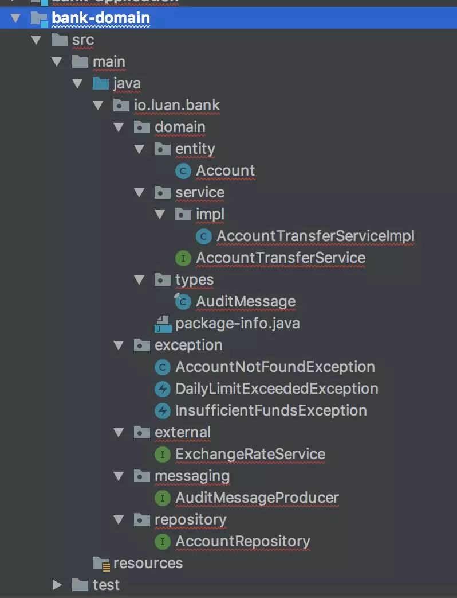
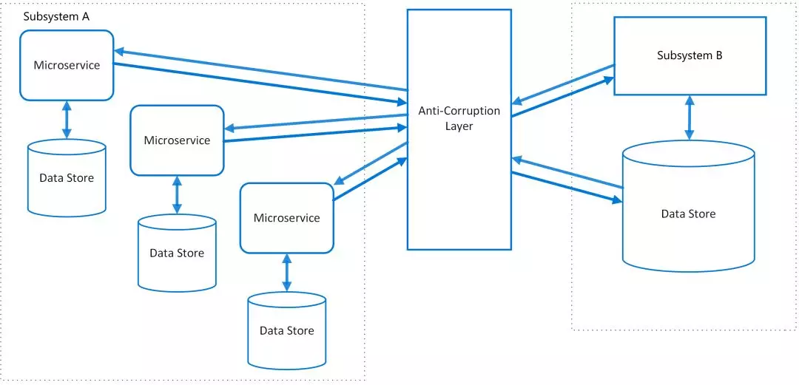
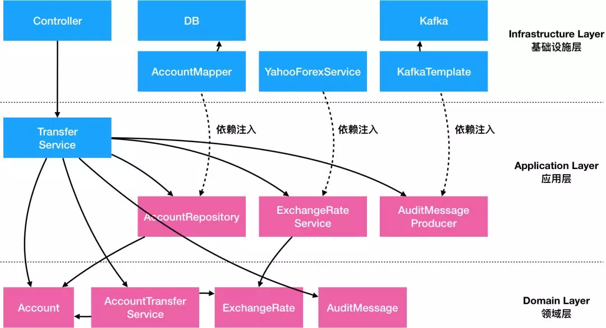

### Domain 模块
* Domain 模块是核心业务逻辑的集中地，包含`有状态的 Entity`、领域服务 Domain Service、以及各种`外部依赖的接口类`（如 Repository、ACL、中间件等）
* Domain 模块仅依赖 Types 模块，也是纯 POJO

* * *

### 领域层
> 主要是封装了核心业务逻辑，并通过领域服务（Domain Service）和领域对象（Domain Entity）的方法对 Application 层提供业务实体和业务逻辑计算
> 
> 领域是应用的核心，不依赖任何其他层次

### 防腐层（ACL）

> 这种常见的设计模式叫做 Anti-Corruption Layer（防腐层或 ACL）。
> 
> 很多时候我们的系统会去依赖其他的系统，而被依赖的系统可能包含不合理的数据结构、API、协议或技术实现，如果对外部系统强依赖，会导致我们的系统被”腐蚀“。
> 
> 这个时候，通过在系统间加入一个防腐层，能够有效的隔离外部依赖和内部逻辑，无论外部如何变更，内部代码可以尽可能的保持不变。

> ACL 不仅仅只是多了一层调用，在实际开发中 ACL 能够提供更多强大的功能：

* `适配器`
  * 很多时候外部依赖的数据、接口和协议并不符合内部规范，通过适配器模式，可以将数据转化逻辑封装到 ACL 内部，降低对业务代码的侵入。
  * 在这个案例里，我们通过封装了 ExchangeRate 和 Currency 对象，转化了对方的入参和出参，让入参出参更符合我们的标准。

* `缓存`
  * 对于频繁调用且数据变更不频繁的外部依赖，通过在 ACL 里嵌入缓存逻辑，能够有效的降低对于外部依赖的请求压力。
  * 同时，很多时候缓存逻辑是写在业务代码里的，通过将缓存逻辑嵌入ACL，能够降低业务代码的复杂度。

* `兜底`
  * 如果外部依赖的稳定性较差，一个能够有效提升我们系统稳定性的策略是通过 ACL 起到兜底的作用，比如当外部依赖出问题后，返回最近一次成功的缓存或业务兜底数据。
  * 这种兜底逻辑一般都比较复杂，如果散落在核心业务代码中会很难维护，通过集中在 ACL 中，更加容易被测试和修改。

* `易于测试`
  * 类似于之前的 Repository，ACL 的接口类能够很容易的实现 Mock 或 Stub，以便于单元测试

* `功能开关`
  * 有些时候我们希望能在某些场景下开放或关闭某个接口的功能，或者让某个接口返回一个特定的值，我们可以在 ACL 配置功能开关来实现，而不会对真实业务代码造成影响。
  * 同时，使用功能开关也能让我们容易的实现 Monkey 测试，而不需要真正物理性的关闭外部依赖。

### 封装业务逻辑

* 用 Domain Primitive 封装跟实体无关的无状态计算逻辑
  * 例如 ExchangeRate
* 用 Entity 封装单对象的有状态的行为，包括业务校验
  * 用 Account 实体类封装所有 Account 的行为，包括业务校验
* 用 Domain Service 封装多 Entity 对象逻辑
  * 用 AccountTransferService 封装多 Entity 对象逻辑 
  * 在这个案例里，我们发现这两个账号的转出和转入实际上是一体的，也就是说这种行为应该被封装到一个对象中去，特别是考虑到未来这个逻辑可能会产生变化：比如增加一个扣手续费的逻辑。
  * 这个时候在原有的 TransferService 中做并不合适，在任何一个 Entity 或者 Domain Primitive 里也不合适，需要有一个新的类去包含跨域对象的行为，这种对象叫做 Domain Service

> 完整重构图

我们可以发现，通过对外部依赖的抽象和内部逻辑的封装重构，应用整体的依赖关系变了：

* 最底层不再是数据库，而是 Entity、Domain Primitive 和 Domain Service
  * 这些对象不依赖任何外部服务和框架，而是纯内存中的数据和操作
  * 这些对象我们打包为 Domain Layer（领域层）
  * 领域层没有任何外部依赖关系

* 再其次的是负责组件编排的 Application Service，但是这些服务仅仅依赖了一些抽象出来的 ACL 类和 Repository 类，而其具体实现类是通过依赖注入注进来的
  * Application Service、Repository、ACL 等我们统称为 Application Layer（应用层）
  * `应用层依赖领域层，但不依赖具体实现`

* 最后是 ACL，Repository 等的具体实现，这些实现通常依赖外部具体的技术实现和框架，所以统称为 Infrastructure Layer（基础设施层）
  * `Web 框架里的对象如 Controller 之类的通常也属于基础设施层`