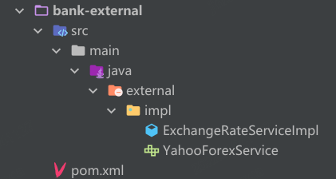

### Infrastructure 模块

* Infrastructure 模块包含了 Persistence、Messaging、External 等模块
* 比如：Persistence 模块包含数据库 DAO 的实现，包含 Data Object、ORM Mapper、Entity 到 DO 的转化类等

* Persistence 模块要依赖具体的 ORM 类库，比如 MyBatis
* 如果需要用 Spring-Mybatis 提供的注解方案，则需要依赖 Spring

