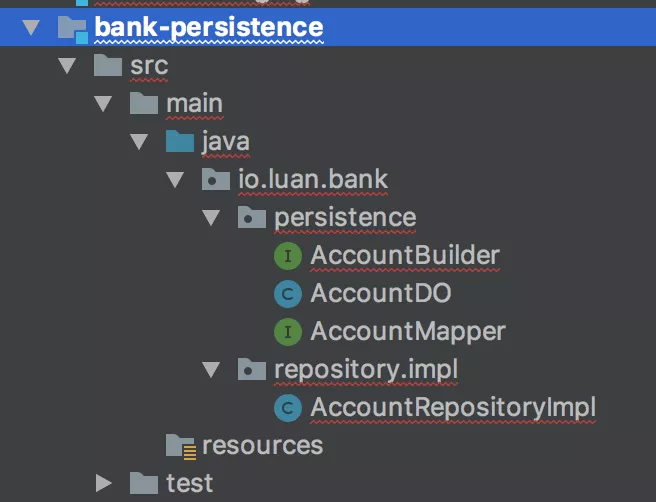

### Infrastructure 模块

* Infrastructure 模块包含了 Persistence、Messaging、External 等模块
* 比如：Persistence 模块包含数据库 DAO 的实现，包含 Data Object、ORM Mapper、Entity 到 DO 的转化类等

* Persistence 模块要依赖具体的 ORM 类库，比如 MyBatis
* 如果需要用 Spring-Mybatis 提供的注解方案，则需要依赖 Spring

> 测试
* Infrastructure 的每个模块的代码相对独立，接口数量比较少，相对比较容易写单测
* 但是由于依赖了外部 I/O，速度上不可能很快，但好在模块的变动不会很频繁，属于一劳永逸

#### Repository 的设计上体现出“软件”的特性，主要需要注意以下三点

* `接口名称不应该使用底层实现的语法`：我们常见的 insert、select、update、delete 都属于 SQL 语法，使用这几个词相当于和 DB 底层实现做了绑定。相反，`我们应该把 Repository 当成一个中性的、类似 Collection 的接口，使用语法如 find、save、remove`。在这里特别需要指出的是区分 insert/add 和 update 本身也是一种和底层强绑定的逻辑，一些储存如缓存实际上不存在 insert 和 update 的差异，在这个 case 里，使用中性的 save 接口，然后在具体实现上根据情况调用 DAO 的 insert 或 update 接口。

* `出参入参不应该使用底层数据格式`：需要记得的是 Repository 操作的是 Entity 对象（实际上应该是 Aggregate Root），而不应该直接操作底层的 DO 。更近一步，`Repository 接口实际上应该存在于 Domain 层，根本看不到 DO 的实现`。这个也是为了避免底层实现逻辑渗透到业务代码中的强保障。

* `应该避免所谓的 “通用” Repository 模式`：很多 ORM 框架都提供一个 “通用” 的 Repository 接口，然后框架通过注解自动实现接口，比较典型的例子是 Spring Data、Entity Framework 等，这种框架的好处是在简单场景下很容易通过配置实现，但是坏处是基本上无扩展的可能性（比如加定制缓存逻辑），在未来有可能还是会被推翻重做。当然，这里避免通用不代表不能有基础接口和通用的帮助类，具体如 Repository 类。