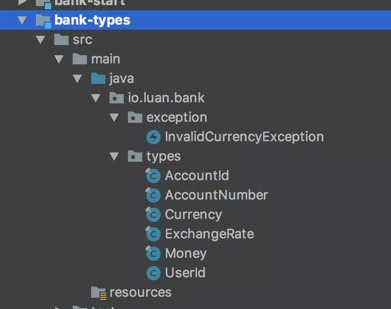

### Types 模块

* Types 模块是保存可以对外暴露的 Domain Primitives 的地方
* Domain Primitives `因为是无状态的逻辑，可以对外暴露`，所以经常被包含在对外的 API 接口中，需要单独成为模块
* `Types 模块不依赖任何类库，纯 POJO` 

> 测试
* Types 属于无外部依赖的纯 POJO，基本上都可以 100% 的被单元测试覆盖

