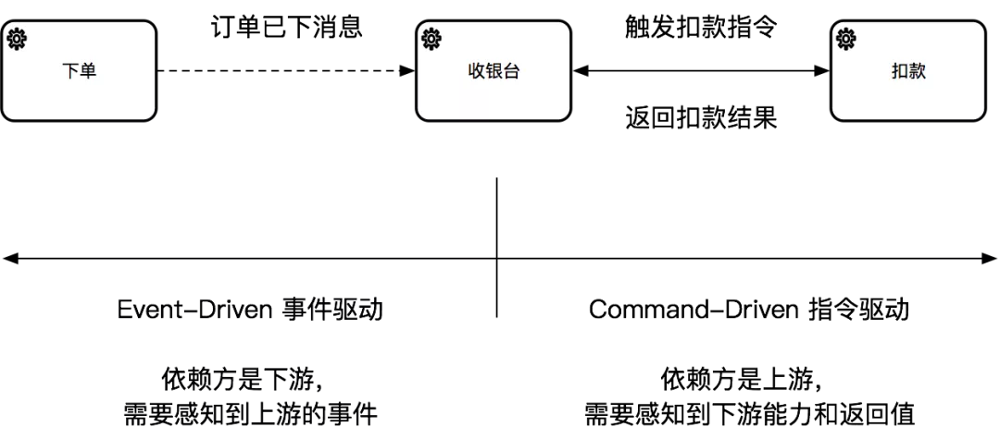
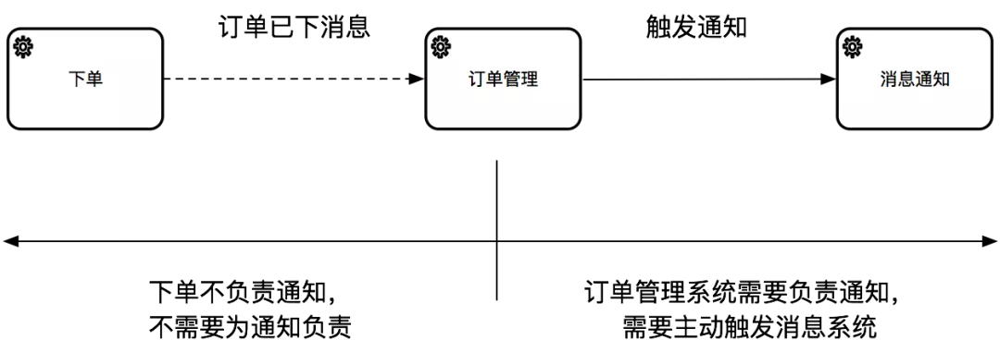

### Orchestration vs Choreography

#### Orchestration vs Choreography

> 从代码依赖关系来看

* Orchestration：涉及到一个服务调用到另外的服务，对于调用方来说，是强依赖服务提供方的
* Choreography：每一个服务只是做好自己的事，然后通过事件触发其他的服务，服务之间没有直接调用上的依赖
    * 但要注意的是下游还是会依赖上游的代码（比如事件类），所以可以认为是下游对上游有依赖

> 从代码灵活性来看

* Orchestration：因为服务间的依赖关系是写死的，增加新的业务流程必然需要修改代码
* Choreography：因为服务间没有直接调用关系，可以增加或替换服务，而不需要改上游代码

> 从调用链路来看

* Orchestration：是从一个服务主动调用另一个服务，所以是 Command-Driven 指令驱动的
* Choreography：是每个服务被动的被外部事件触发，所以是 Event-Driven 事件驱动的

> 从业务职责来看
* Orchestration：有主动的调用方（比如：下单服务）
    * 无论下游的依赖是谁，主动的调用方都需要为整个业务流程和结果负责
* Choreography：没有主动调用方，每个服务只关心自己的触发条件和结果，没有任何一个服务会为整个业务链路负责

另外需要重点明确的：“指令驱动” 和 “事件驱动” 的区别不是 “同步” 和 “异步”

指令可以是同步调用，也可以是异步消息触发（但异步指令不是事件）；反过来事件可以是异步消息，但也完全可以是进程内的同步调用

所以指令驱动和事件驱动差异的本质不在于调用方式，而是`一件事情是否 “已经” 发生`

##### 两个判断方法

> 明确依赖的方向

在代码中的依赖是比较明确的：

* 如果你是下游，上游对你无感知，则只能走事件驱动；如果上游必须要对你有感知，则可以走指令驱动
* 如果你是上游，需要对下游强依赖，则是指令驱动；如果下游是谁无所谓，则可以走事件驱动

> 找出业务中的 “负责人”

* 如果业务需要通知卖家，下单系统的单一职责不应该为消息通知负责，但订单管理系统需要根据订单状态的推进主动触发消息，所以是这个功能的负责人

* * *

反例：最近几年比较流行的 Event-Driven Architecture（EDA）事件驱动架构，以及 Reactive-Programming 响应式编程（比如 RxJava），虽然有很多创新，但在一定程度上是 `“当你有把锤子，所有问题都是钉子”` 的典型案例。他们对一些基于事件的、流处理的问题有奇效，但如果拿这些框架硬套指令驱动的业务，就会感到代码极其 “不协调”，认知成本提高。所以在日常选型中，还是要先根据业务场景梳理出来是哪些流程中的部分是 Orchestration，哪些是 Choreography，然后再选择相对应的框架。

#### 跟 DDD 分层架构的关系

* O&C 其实是 Interface 层的关注点，Orchestration = 对外的 API，而 Choreography = 消息或事件。
  * 当你决策了 O 还是 C 之后，需要在 interface 层承接这些 “驱动力”
* 无论 O&C 如何设计，Application 层都 “无感知”
  * 因为 ApplicationService 天生就可以处理 Command、Query 和 Event，至于这些对象怎么来，是 Interface 层的决策

所以，虽然 Orchestration 和 Choreography 是两种完全不同的业务设计模式，但最终落到 Application 层的代码应该是一致的，这也是为什么 Application 层是 “用例” 而不是 “接口”，是相对稳定的存在