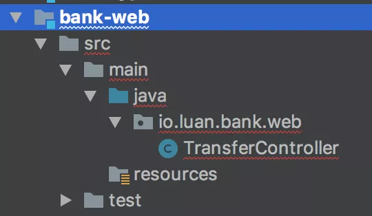

### Web 模块

* Web 模块包含 Controller 等相关代码
* 如果用 SpringMVC 则需要依赖 Spring

> 测试
* Web 模块有两种测试方法：通过 Spring 的 MockMVC 测试，或者通过 HttpClient调用接口测试
* 但是在测试时最好把 Controller 依赖的服务类都 Mock 掉
* 一般来说当你把 Controller 的逻辑都后置到 Application Service 中时，Controller 的逻辑变得极为简单，很容易 100% 覆盖

