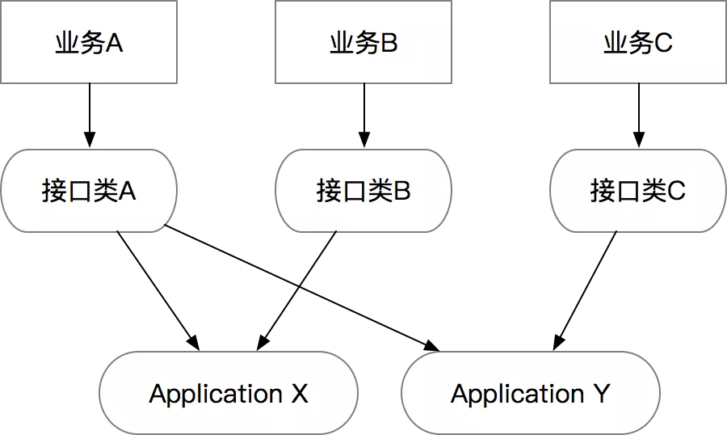

### 接口层

``` 
职责：主要负责承接网络协议的转化、Session 管理等

接口数量：避免所谓的统一 API，不必人为限制接口类的数量，每个/每类业务对应一套接口即可，接口参数应该符合业务需求，避免大而全的入参

接口出参：统一返回 Result

异常处理：应该捕捉所有异常，避免异常信息的泄漏，可以通过 AOP 统一处理，避免代码里有大量重复代码
```

> 接口层主要由以下几个功能组成
* 网络协议的转化
  * 通常这个已经由各种框架给封装掉了，我们需要构建的类要么是被注解的 bean，要么是继承了某个接口的 bean

* 统一鉴权
  * 比如在一些需要 AppKey+Secret 的场景，需要针对某个租户做鉴权的，包括一些加密串的校验

* Session 管理
  * 一般在面向用户的接口或者有登陆态的，通过 Session 或者 RPC 上下文可以拿到当前调用的用户，以便传递给下游服务

* 限流配置
  * 对接口做限流避免大流量打到下游服务

* 前置缓存
  * 针对变更不是很频繁的只读场景，可以前置结果缓存到接口层

* 异常处理
  * 通常在接口层要避免将异常直接暴露给调用端，所以需要在接口层做统一的异常捕获，转化为调用端可以理解的数据格式

* 日志
  * 在接口层打调用日志，用来做统计和 debug 等
  * 一般微服务框架可能都直接包含了这些功能

当然，如果有一个独立的网关设施/应用，则可以抽离出鉴权、Session、限流、日志等逻辑

> 但是目前来看 API 网关也只能解决一部分的功能，即使在有 API 网关的场景下，应用里独立的接口层还是有必要的

####  返回值和异常处理规范，Result vs Exception

这部分主要还是面向 REST 和 RPC 接口，其他的协议需要根据协议的规范产生返回值

* 规范：Interface 层的 HTTP 和 RPC 接口，返回值为 Result，捕捉所有异常
  * 当然，每个接口都要写异常处理逻辑会比较烦，所以可以用 AOP 做个注解
* 规范：Application 层的所有接口返回值为 DTO，不负责处理异常

#### 接口层的接口的数量和业务间的隔离

在实际做业务的过程中，特别是当支撑的上游业务比较多时，刻意去追求接口的统一通常会导致方法中的参数膨胀，或者导致方法的膨胀

迭代过程中，服务未来越来越难以维护，方法越来越多，一个业务的变更有可能会导致整个服务/Controller 的变更，最终变得无法维护

* 规范：一个 Interface 层的类应该是 “小而美” 的，应该是面向 “一个单一的业务” 或 “一类同样需求的业务”，需要尽量避免用同一个类承接不同类型业务的需求

这个的好处是符合了 Single Responsibility Principle 单一职责原则，也就是说一个接口类仅仅会因为一个（或一类）业务的变化而变化

一个建议是当一个现有的接口类过度膨胀时，可以考虑对接口类做拆分，拆分原则和 SRP 一致

> 大量的接口类，导致代码逻辑重复？

* 答案是不会，因为在 DDD 分层架构里，接口类的核心作用仅仅是协议层，每类业务的协议可以是不同的，而真实的业务逻辑会沉淀到应用层
* 也就是说 Interface 和 Application 的关系是多对多的

因为业务需求是快速变化的，所以接口层也要跟着快速变化，通过独立的接口层可以避免业务间相互影响，但我们希望相对稳定的是 Application 层的逻辑

 